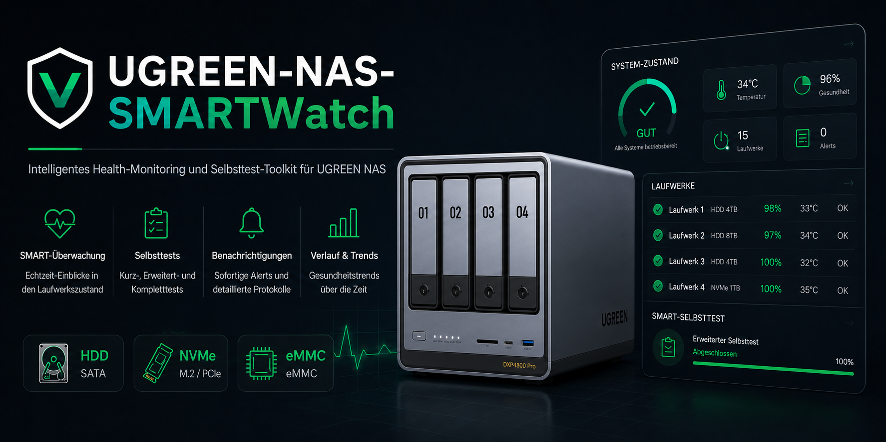
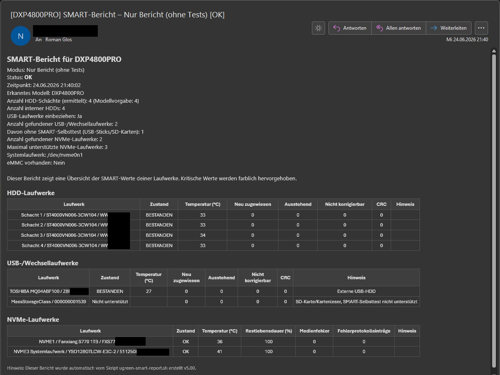
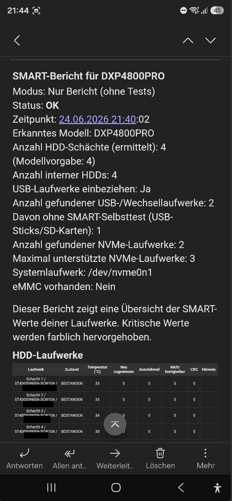
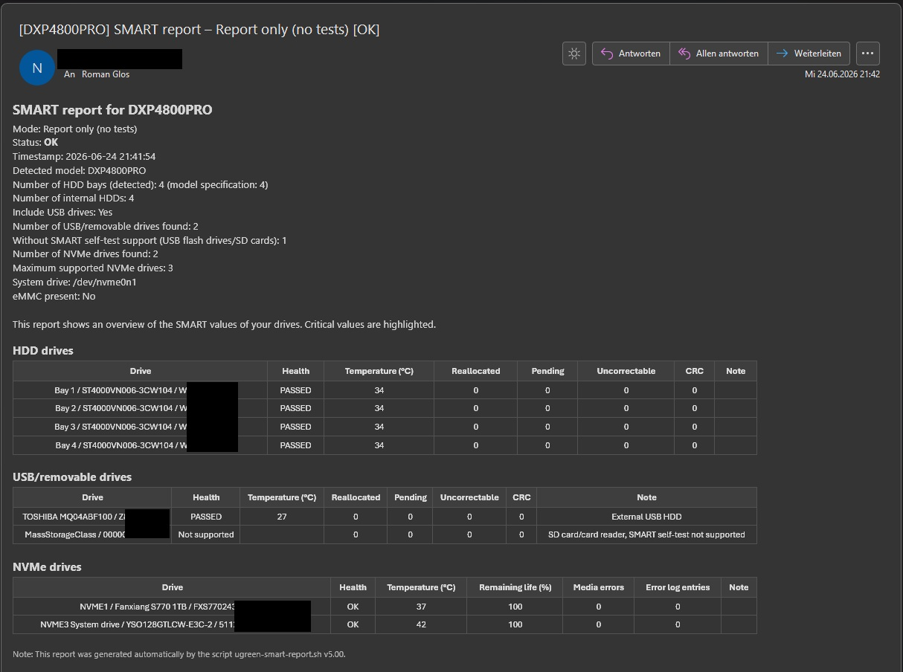
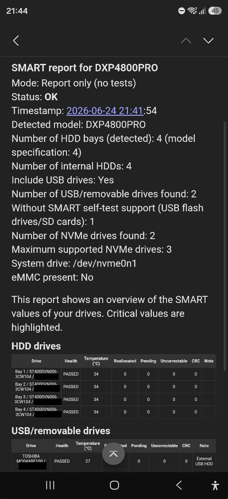

# UGREEN-NAS-SMARTWatch


UGREEN-NAS-SMARTWatch ist ein leichtgewichtiges Bash-Skript für UGREEN NAS mit UGOS.  
Das Skript liest SMART-Werte von HDD-, NVMe-, USB- und eMMC-Laufwerken aus, kann SMART-Selbsttests starten und versendet einen Outlook-freundlichen HTML-Report per E-Mail.

## Features

- SMART-Überwachung für HDD, NVMe, USB und eMMC
- Wöchentlicher Kurztest und monatlicher Langtest
- Outlook-freundlicher HTML-Report
- DE/EN-Ausgabe per `LANGUAGE`
- USB-/Wechsellaufwerke optional einbeziehbar
- NVMe-Stillstandserkennung bei festhängenden Selbsttests
- Cron-tauglich, auch ohne interaktives Shell-Environment
- Für UGREEN NAS / UGOS optimiert

## Screenshots

### Deutsch (DE)
| Outlook | Mobile Ansicht |
|---|---|
|  |  |

### Englisch (EN)
| Outlook | Mobile Ansicht |
|---|---|
|  |  |


## Projektstruktur

```text
UGREEN-NAS-SMARTWatch/
├─ LICENSE
├─ README.md
├─ UGREEN_SMARTWatch_Manual_DE-EN_v4.00.pdf
├─ Screens/
│  ├─ SMARTWatch.png
│  ├─ SMARTWatch1280.jpg
│  ├─ Outlook.jpg
│  ├─ OutlookEN.jpg
│  ├─ Mobil.jpg
│  └─ MobileEN.jpg
└─ SmartWatch/
   ├─ ugreen-smart-report.sh
   └─ smart-report.env.example
```

## Voraussetzungen

- UGREEN NAS mit UGOS

## Installation (Quickstart)

1) Paket auf das NAS kopieren, zum Beispiel nach:  
`/volume2/NASAdmin/Skripte/SmartWatch/`

2) In den Ordner wechseln:
```bash
cd /volume2/NASAdmin/Skripte/SmartWatch
```

3) Beispielkonfiguration kopieren:
```bash
cp smart-report.env.example smart-report.env
```

4) Konfiguration anpassen:
```bash
nano smart-report.env
```

5) Skript ausführbar machen:
```bash
chmod +x ugreen-smart-report.sh
```

## Test und Nutzung

### Testmail senden
```bash
bash ./ugreen-smart-report.sh --test-mail
```

### Nur Report erzeugen
```bash
bash ./ugreen-smart-report.sh --report-only
```

### Wöchentlichen Kurztest starten
```bash
bash ./ugreen-smart-report.sh --weekly-short
```

### Monatlichen Langtest starten
```bash
bash ./ugreen-smart-report.sh --monthly-long
```

### Hilfe anzeigen
```bash
bash ./ugreen-smart-report.sh --help
```

## Cron-Beispiel

Für die Nutzung per `crontab -e` wird empfohlen, `SHELL` und `PATH` explizit zu setzen:

```bash
SHELL=/bin/bash
PATH=/usr/local/sbin:/usr/local/bin:/usr/sbin:/usr/bin:/sbin:/bin

0 3 * * 1 /usr/bin/flock -n /tmp/smarthealth.lock /bin/bash /volume2/NASAdmin/Skripte/SmartWatch/ugreen-smart-report.sh --weekly-short >/dev/null 2>&1
15 4 1 * * /usr/bin/flock -n /tmp/smarthealth.lock /bin/bash /volume2/NASAdmin/Skripte/SmartWatch/ugreen-smart-report.sh --monthly-long >/dev/null 2>&1
```

## Konfiguration

Alle Einstellungen basieren auf der Datei:

```text
SmartWatch/smart-report.env.example
```

Auf der NAS wird daraus deine aktive Konfiguration erstellt:

```bash
cp smart-report.env.example smart-report.env
```

Wichtige Optionen:

- `LANGUAGE`
- `LOG_DIR`
- `LOG_RETENTION_DAYS`
- `MAIL_FROM`
- `MAIL_TO`
- `SMTP_SERVER`
- `SMTP_PORT`
- `SMTP_USER`
- `SMTP_PASS`
- `INCLUDE_USB_DRIVES`
- `EMMC_ENABLE_CHECK`
- `EMMC_ENABLE_READTEST`
- `NVME_MAX_WAIT_SHORT_MIN`
- `NVME_MAX_WAIT_LONG_MIN`
- `NVME_STALL_DETECTION`

Empfohlene Standardpfade für Nutzer:

- Skriptpfad: `/volume2/NASAdmin/Skripte/SmartWatch`
- Logpfad: `/volume2/NASAdmin/Logs/SmartWatch`

## Dokumentation

- Handbuch (PDF): `UGREEN_SMARTWatch_Manual_DE-EN_v4.00.pdf`

## Lizenz

MIT License

## Version

- v4.00

<!-- refresh contributors graph -->
